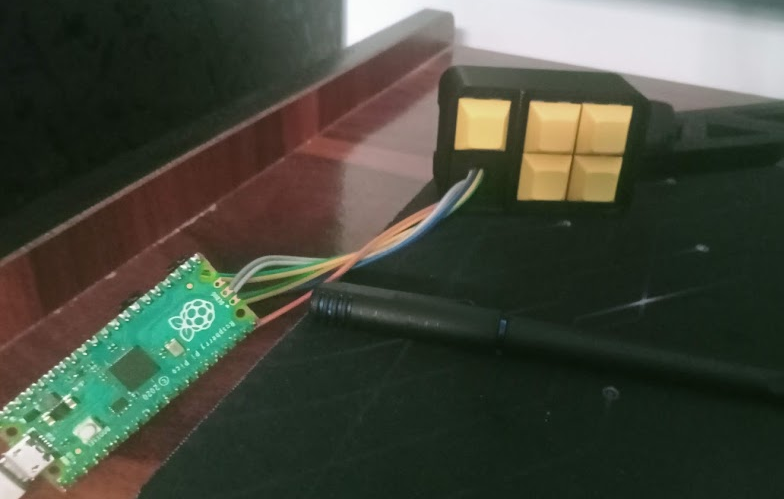
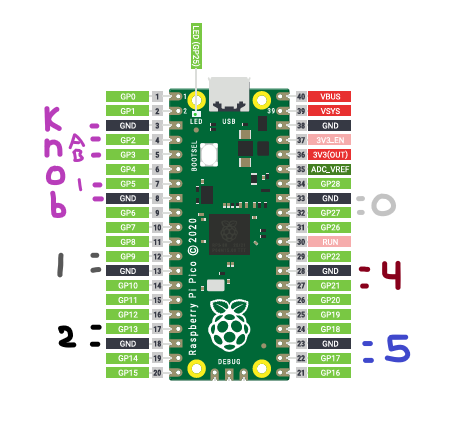

# Customized and Modified Bento Macro Pad (KMK Firmware)

Custom, 3D-printed macro pad running on a Raspberry Pi Pico. Project uses KMK firmware and is pretty easy to customize manually.

Also includes a companion Python script for the host PC that reads serial outputs to render a simple On-Screen Display whenever layers change.

## My Result

  
*Functional prototype that made me realise how awkwardly big dupont wires can be, but if it works why fix it (though of course the repository prints are fixed and made taller).*

## Bill of Materials (BOM)

* **Microcontroller:** Raspberry Pi Pico
* **Switches:** 5x Mechanical Switches And Keycaps
* **Encoder:** 1x Bare EC11 Rotary Encoder (No PCB, if you do not get a knob don't worry the repository has a modified version of a knob for this encoder)
* **Wiring:** Female-to-Female DuPont jumper wires
* **Enclosure:** Custom 3D printed top shell and bottom plate (included in the Repository)

## 3D Printed Enclosure

**Note on Case Clearances:** The original case design assumes a bare EC11 rotary encoder and a Pico sitting completely flush. This repository includes modified `.stl` files:

* The top shell has been extended vertically to accommodate bulky DuPont wiring.
* The bottom plate features longer walls to support the clearance required for the through-hole header pins on the bottom of the Pico and still fit perfectly well.
* The Knob has been modified to fit much more tightly on the encoder and adjusted so that it actually clicks easily.

## Wiring & Pinout

Build uses direct GPIO mapping to the Pico and relies entirely on internal pull-up resistors. **Every mechanical switch is paired with an immediately neighboring Ground (GND) pin on the Pico** to prevent messy daisy-chaining.

  
*Showcase of the exact pinout and ground pairings.*

### Mechanical Switches

| Component | Pico Pin | Adjacent Ground Pin |
| :--- | :--- | :--- |
| Button 0 (Layer Shift) | `GP27` | `GND` |
| Button 1 | `GP9` | `GND` |
| Button 2 | `GP13` | `GND` |
| Button 3 | `GP17` | `GND` |
| Button 4 | `GP21` | `GND` |

### EC11 Rotary Encoder

*Note: A bare EC11 does **not** take external power. Do not connect it to the 5V or 3V3 pins. It relies purely on the Pico's internal pull-up resistors.*

| Component | EC11 Pin | Pico Pin |
| :--- | :--- | :--- |
| Encoder Clock | Pin A (3-pin side, Left) | `GP2` |
| Common Ground | Pin C (3-pin side, Middle) | `GND` |
| Encoder Data | Pin B (3-pin side, Right) | `GP3` |
| Knob Push-Button | Switch Pin 1 (2-pin side) | `GP5` |
| Switch Ground | Switch Pin 2 (2-pin side) | `GND` |

## How to get the pins to act nice

This hurdle is due to how the mechanical switches and EC11 pins are, flat prongs meant to go in designated prong holes. This is great, but, it also makes dupont female pins slip easily, so, take a pair of pliers (or a nailclipper will be suffice) and on one end of the wires apply pressure on the head until you hear a click sound, and the plastic front comes off. This crushes the head to accept flat prongs much more easily (and yes it still works). 

Insert the wire and rotate it a little, and it should not slip anymore.

## Firmware & Layer Architecture

The firmware relies on `KMKKeyboard`. The code allows you to swap between different defined layers with a combination of Button 0 with the other 4 buttons (can be extended if you really wanna use encoder's left right and click but not recommended).

* **Hold Button 0** to access Layer 4 (Switching Layer).
* While holding Button 0, tap Buttons 1-4 to swap the base layer.

### Stack of Layers

* **Layer 0 (System):** Snipping Tool, Copy, Paste, Task Manager. (Encoder: Scroll & Click).
* **Layer 1 (Media):** Play/Pause, Volume Down, Volume Up, Mute. (Encoder: Volume & Mute).
* **Layer 2 (Browser):** Reopen Tab, Tab Left, Tab Right, Close Tab. (Encoder: Scroll & Click).
* **Layer 3 (Blank):** F13 - F16 for custom global hotkeys. (Encoder: Scroll & Click).
* **Layer 4 (Switcher):** Routes to `KC.DF(0)` through `KC.DF(3)`.

## Unmounted Drive by Default (`boot.py`)

* **How it works:** Hold **Button 0** while plugging in the USB cable to force the drive to mount so you can edit the firmware. Without this the drive won't be mounted, which also means less clutter and no popup on plugging in.

## On-Screen Display (OSD) Companion Script

This repository includes a `macropad_osd.pyw` script meant to run on your host Windows PC. Just add its shortcut to the Startup folder or run it manually each time you wish to use it.

## Credits & Resources

* **KMK Firmware:** [KMK Firmware GitHub](https://github.com/KMKfw/kmk_firmware)
* **Bento Case Design for Pi Pico:** [Cyanody - Bento Macropad](https://www.printables.com/model/155366-bento-macropad-pi-pico)
* **Knob Design:** [Soemarko - Knurled Knob for KY-040 Rotary Encoder](https://www.printables.com/model/191627-knurled-knob-for-ky-040-rotary-encoder/)